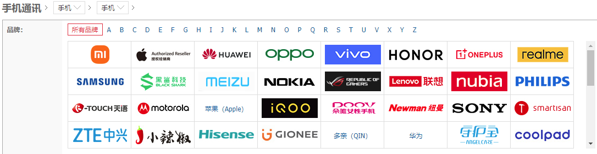
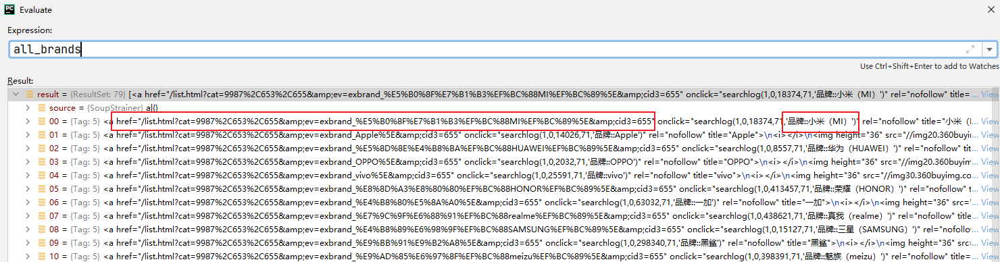
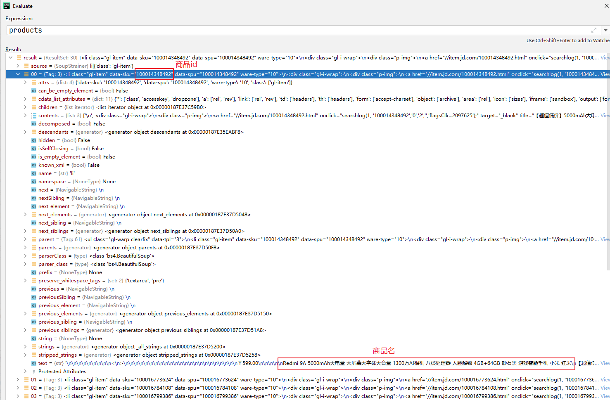
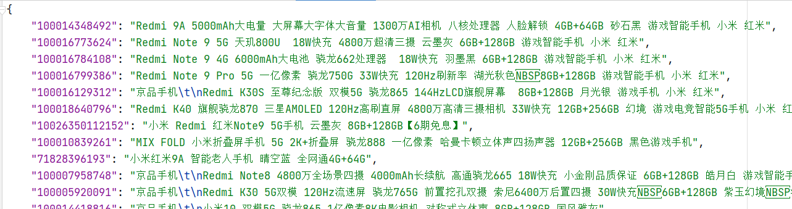
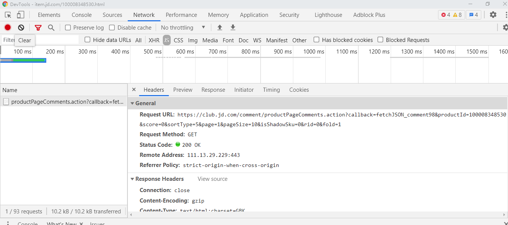
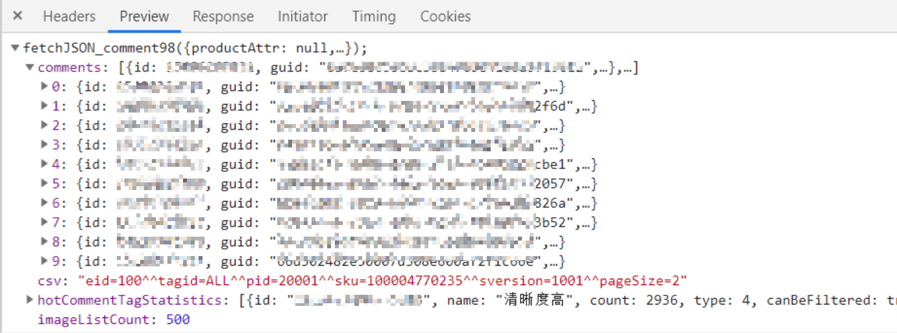

### JD Spider

京东的手机评论数据爬虫，仅供学习使用

#### 说明

本项目用于中文意见抽取任务，抽取了京东商城上的部分手机评论数据。由于项目的数据量要求不大，本repo仅仅采用了比较简单的方式来进行数据的爬取，过程分为两个部分:

- 根据不同的手机品牌选择了第一页的三十个条目，提取其名称和京东商品的编号。
- 根据商品编号，直接使用分析出的请求接口来请求对应的评论数据。

具体内容如下：
#### Step 1 不同品牌对应的链接的获取
首先，jd手机类的商品列表都在`https://list.jd.com/list.html?cat=9987,653,655` 链接下:

通过requests请求以及beautifulsoup的选择器可以拿到所有品牌对应的链接
```python
# 拿到所有手机品牌的链接
_temp = soup.find_all(name="ul",attrs={"class":"J_valueList v-fixed"})
all_brands = _temp[0].find_all(name="a")
```
示例：


#### Step 2 请求某个品牌对应的产品列表页
基于上一步得到的品牌链接，继续使用requests请求该链接，可以拿到该品牌的产品列表，由于对数据的需求量不大，本人只对品牌第一页的数据进行了爬取，同样是基于beautifulsoup选择器，拿到每一个产品的id和名称，并将其保存到本地文件中，方便之后爬虫断点恢复。
```python
products_soup = BeautifulSoup(brand_products_source.content.decode("utf8"), 'lxml')
# 处理第一页的30条数据，拿到id号和title名称
products = products_soup.find_all(name="li",attrs={"class":"gl-item"})
```

遍历完所有品牌之后，就能拿到包含id和商品名的json文件：

#### Step 3 商品评论接口分析
在京东商品页，通过chrome的F12分析工具可以分析评论加载的方式：当点击评论的下一页之后，会向`https://club.jd.com/comment/productPageComments.action?` 发起一个请求，请求的参数携带的就是商品id以及当前评论页数，返回的内容里面包含了当页的十条评论，通过对返回内容进行处理可以得到目标评论句。
- 点击下一步后的网络请求结果

- response内容

#### Step 4 爬虫构建
爬虫的base_url为`https://club.jd.com/comment/productPageComments.action?callback=fetchJSON_comment98&productId={}&score=0&sortType=5&page={}&pageSize=10&isShadowSku=0&rid=0&fold=1` ,其中两个大括号内分别填充商品id和评论的页数，之后就可以通过requests请求来爬取需要的数据。